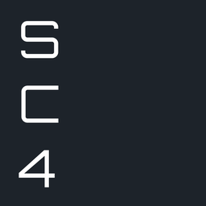

# 🚀 Shinden Client 4

> **Nowoczesna, szybka aplikacja desktopowa dla użytkowników Shinden.pl**  
> Stworzona z pasji do anime — oparta na **Rust + Tauri + SvelteKit**.

---

## 🧩 Co to jest?

**Shinden Client** to natywna aplikacja do przeglądania i oglądania anime na Shinden.pl — bez reklam, śledzenia i zbędnych elementów.  
Zamiast przeglądarki, dostajesz lekki, szybki i skoncentrowany na treści interfejs, który po prostu działa.

## 🌟 Najważniejsze cechy

- ⚡ **Błyskawiczne działanie** – aplikacja startuje w mniej niż sekundę
- 💾 **Niskie zużycie zasobów** – mniej niż 10 MB RAM
- 🧼 **Czysty interfejs bez reklam i popupów**
- 🌗 **Motywy jasny / ciemny**
- 🪵 **Konsola błędów i logów** — pomocna przy zgłoszeniach
- 📺 **Wbudowany odtwarzacz dla treści z cda.pl**

---

# 🌠 Zrzuty ekranu
...
---

# LICENCJA

MIT © 2025 Błażej Drozd
This project is not affiliated with Shinden.pl. It does not host or redistribute any copyrighted content.

Projekt nie jest powiązany z Shinden.pl.
Nie hostuje ani nie rozpowszechnia treści objętych prawem autorskim.
Służy wyłącznie jako alternatywny interfejs do istniejącej strony.

# ❤️ Wesprzyj rozwój
- ⭐ Zostaw gwiazdkę, jeśli Ci się podoba
- 🐞 Zgłoś błąd lub otwórz dyskusję
- 🧪 Pomóż testować nowe funkcje
- 🔧 Pull Requesty mile widziane!
