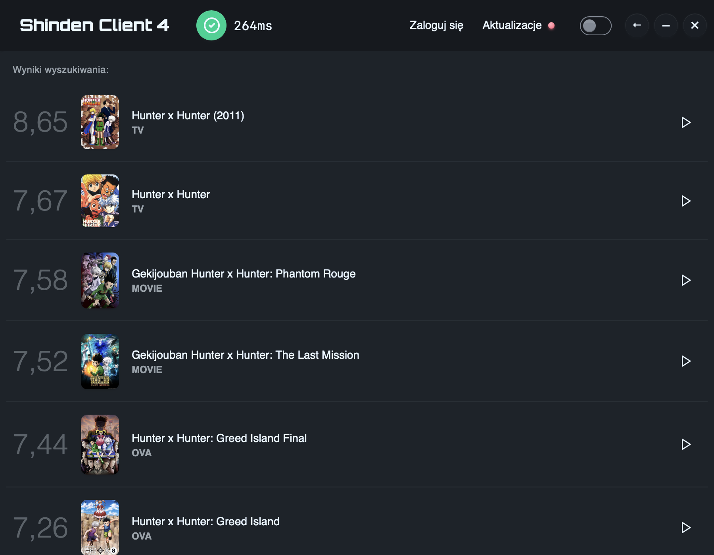
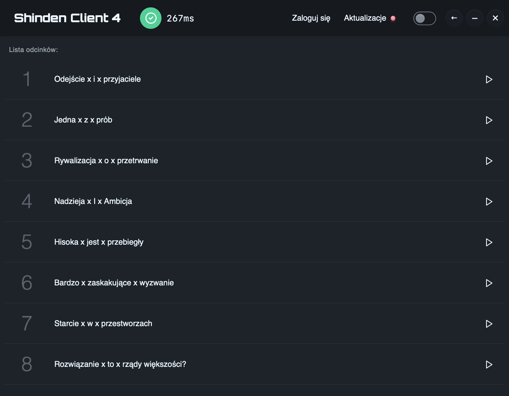
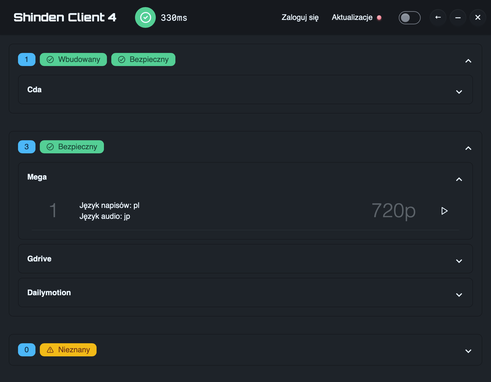
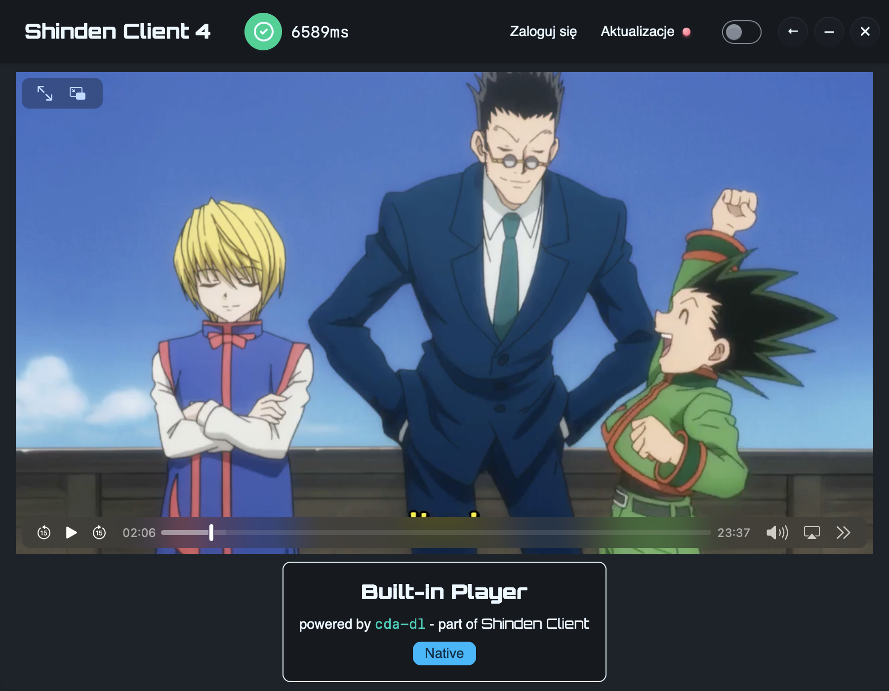

# Shinden Client 4

Aplikacja desktopowa dla użytkowników serwisu Shinden.pl. Zbudowana przy użyciu frameworka Tauri (Rust + SvelteKit).


## Opis projektu

Shinden Client to natywne rozwiązanie umożliwiające przeglądanie zasobów serwisu Shinden.pl. Głównym celem projektu jest dostarczenie wydajnego interfejsu, pozbawionego reklam i elementów śledzących, typowych dla standardowych przeglądarek internetowych.

## Funkcjonalności

- Wysoka wydajność i szybki czas uruchamiania.
- Interfejs oczyszczony z reklam oraz okien typu popup.
- Obsługa motywów jasnego i ciemnego.
- Zintegrowana konsola logów ułatwiająca diagnostykę.
- Natywny odtwarzacz wspierający treści z cda.pl bez reklam.

## Kompatybilność

| System operacyjny | Status wsparcia |
|-------------------|-----------------|
| Windows           | Pełne           |
| macOS             | Pełne           |
| GNU/Linux         | Częściowe       |

### Wsparcie na systemach GNU/Linux

W środowiskach wykorzystujących protokół Wayland mogą wystąpić problemy z renderowaniem interfejsu. W takim przypadku zaleca się skorzystanie z X11 lub uruchomienie aplikacji z wyłączonym rendererem DMABUF:

```bash
WEBKIT_DISABLE_DMABUF_RENDERER=1 ./shinden-client.AppImage
```

Problem wynika bezpośrednio z działania WebKitGTK wewnątrz frameworka Tauri. Dokumentacja błędu dostępna jest w [repozytorium Tauri](https://github.com/tauri-apps/tauri/issues/10702).

## Zrzuty ekranu







## Licencja i wyłączenie odpowiedzialności

MIT © 2025 Błażej Drozd

Projekt Shinden Client nie jest powiązany z serwisem Shinden.pl. Aplikacja nie hostuje ani nie redystrybuuje treści objętych prawem autorskim. Służy wyłącznie jako alternatywny interfejs użytkownika.

## Wsparcie rozwoju

- Prześlij zgłoszenie błędu (Issue).
- Zaproponuj zmiany poprzez Pull Request.
- Pomóż w testowaniu nowych wersji aplikacji.
